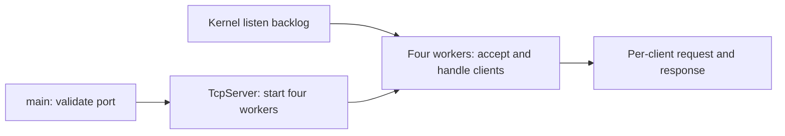

# Multithreaded HTTP Server

## Overview

An incremental C++ systems programming project working toward a multithreaded
HTTP server. Stage 7 uses four reusable worker threads. Each worker accepts a
client, parses a basic HTTP request line, prints its fields, sends the existing
HTTP response, closes the client socket, and returns to accept another client.

## Features

- IPv4 TCP listener on loopback (`127.0.0.1`).
- Four fixed `std::thread` workers, reused across client connections.
- Default port 8080, with an optional command-line port from 1 to 65535.
- Socket address reuse, system-call error reporting, and explicit socket cleanup.
- Request-line collection across multiple receives, limited to 1,024 bytes.
- Basic method, path, and HTTP version extraction with malformed-input checks.
- HTTP/1.1 200 OK and 400 Bad Request responses with plain-text bodies.
- CRLF response formatting, computed Content-Length, and Connection: close.
- Partial-send and interrupted-call handling.
- Orderly client disconnect handling and connection-reset error reporting.
- TCP smoke validation, including byte counts, replies, and disconnects.

## Architecture

`main.cpp` validates the command-line port and calls `TcpServer::run()`.
The three classes have distinct responsibilities:

| Class | Responsibility |
| --- | --- |
| `TcpServer` | Listening socket, fixed worker startup/join, per-worker accept loops, client I/O, and socket cleanup. |
| `HttpRequest` | Validate the request line and store its method, path, and version as owned strings. No socket I/O or printing. |
| `HttpResponse` | Own the status and body and serialize the same HTTP/1.1 response bytes, including CRLF and Content-Length. No socket I/O. |



The socket lifecycle remains visible in `src/tcp_server.cpp`:

```text
main:   socket → setsockopt → bind → listen → start four threads → join
worker: repeat accept → recv line → parse → send response → close client socket
```

`accept()` blocks until a client connects and returns a separate socket for that
client. All four workers call `accept()` on the shared listener; the kernel
assigns each connection to one caller. No new thread is created for a client.
The accepting worker calls `handle_client()`, then returns to its accept loop.
Inside the worker, `TcpServer::communicate_with_client()` collects a line, calls
`HttpRequest::parse_request_line()`, and prints the fields. Valid input gets a
fixed 200 OK response. `HttpResponse::serialize()` builds the status line,
headers, computed body length, blank line, and body. `TcpServer::send_response()`
sends that string.
The server retries interrupted calls and loops until all response
bytes have been sent. `MSG_NOSIGNAL` lets a failed send report an error instead
of terminating the process with SIGPIPE. Client errors close only that connection;
the workers keep serving. Invalid arguments and setup errors return 1. Accept
retries EINTR. On other accept errors, the listener is shut down to wake workers
waiting in accept; `run()` joins the workers, closes the listener, and returns 1.
Workers already handling clients finish first, so a stalled client can delay
this error cleanup indefinitely. This is not a graceful shutdown framework.

`run()` owns the listener and a fixed array of four joinable threads. The worker
that accepts a connection exclusively owns and closes that client descriptor,
including on a C++ exception. Workers do not capture `this`. Every client has
its own stack buffer, received string, parser object, response, and send offset.
No application receive buffer or mutable request data is shared.

A single startup mutex protects a `pool_ready` flag. The main thread holds it
while creating the pool; workers briefly acquire it before accepting anything.
If creation fails partway through, the flag stays false: created workers return,
the main thread joins them, closes the listener, and exits 1. On success the
flag becomes true and the mutex is released. It is never used in client handling.
This small startup gate prevents partially created pools from accepting clients
that would otherwise block rollback.

When all four workers are busy, new connections wait in the kernel listen
backlog (requested size 16, subject to OS limits). Once it fills, connection
attempts may wait, time out, or fail; there is no application overload response.
There is no application task queue or condition variable yet: Stage 8 introduces
the reusable synchronized queue. This stage's pool is specific to socket work.

The worker count is the constant `worker_count = 4` in `TcpServer::run()`.
There is no idle timeout: four slow clients can occupy the whole pool. Console
output may interleave. Ctrl+C still stops the process immediately and the OS
reclaims descriptors; no signal handler or graceful shutdown was added.

TCP is a byte stream: one `recv()` need not contain everything the client sent.
The server appends exactly the received byte count until a newline arrives,
then requires CRLF and parses only the first line. Collection stops at 1,024
bytes (including CRLF); an unfinished line at that limit is rejected. EOF after
partial input is reported as incomplete. Malformed, incomplete, or overlong
lines get a 400 Bad Request response when the client can still receive data.
Rejected requests close their client socket after the reply without stopping the server.

The supported format is `METHOD /path HTTP/1.1\r\n` (also HTTP/1.0), with exactly
one space between fields. Method tokens are checked syntactically; parsing a
method does not implement its behavior. Paths must start with `/` and contain
only visible ASCII characters. Queries remain part of the printed path; URI
decoding and full URI validation are not implemented. Absolute-form targets
and `*` are outside this stage's supported subset.

All syntactically valid lines receive the same response regardless of path.
There is no routing or method-specific behavior (including POST or HEAD).
Responses use HTTP/1.1 even when the parsed request line says HTTP/1.0.

Headers or body bytes already received after the first line are ignored.
The server does not wait for or consume a complete HTTP request. Sending further
data while it closes may cause a TCP reset because unread data can remain.

## Technologies / Concepts

C++17, CMake, TCP/IP, POSIX sockets, file descriptors, network byte order,
blocking system calls, byte streams, partial sends, HTTP request-line syntax,
status lines, response headers, body lengths, basic classes and encapsulation,
`std::thread`, a fixed worker pool, a startup mutex, per-client ownership,
and basic error handling.
Python 3 is used only for tests.

## Project Structure

- `src/main.cpp`: port validation and server startup.
- `include/tcp_server.h`, `src/tcp_server.cpp`: socket lifecycle and client I/O.
- `include/http_request.h`, `src/http_request.cpp`: request-line parsing and fields.
- `include/http_response.h`, `src/http_response.cpp`: HTTP response construction.
- `tests/tcp_smoke.py`: real-process TCP checks using Python's standard library.
- `CMakeLists.txt`: executable, Threads::Threads linkage, warnings, and CTest integration.
- `AGENTS.md`: permanent development rules.
- `ROADMAP.md`: stage scope and completion status.

## Build

Use Linux (including a WSL distribution) with a C++17 compiler and CMake
3.16 or newer. Native Windows/MinGW builds are not supported by the POSIX source.
For Ubuntu, prerequisites can be installed with:

```sh
sudo apt-get update
sudo apt-get install build-essential cmake python3
```

On Alpine Linux, run `apk add --no-cache build-base cmake python3` as root.
Stages 1 through 7 were validated on Alpine Linux 3.22 under WSL2 with GCC 14.2.0,
CMake 3.31.7, and Python 3.12.14.

On this Windows development machine, enter the installed Linux environment:

```powershell
wsl -d HTTPServer-Alpine
```

Then navigate to the existing checkout inside Linux:

```sh
cd /mnt/c/Users/skg21/Documents/projects/HTTPS_Server
```

From the project root inside Linux:

```sh
cmake -S . -B build
cmake --build build
```

## Run

```sh
./build/http_server
# Optional custom port:
./build/http_server 9090
```

The listener is local-only and runs until stopped with Ctrl+C. Each client gets
one request and response, then its socket closes; the listener remains open.
A partial line occupies one worker. Other clients can be accepted while another
worker is free; with all four occupied, new clients wait.

## Usage

In another terminal in the same Linux environment:

```sh
printf 'GET /index.html HTTP/1.1\r\nHost: localhost\r\n\r\n' | nc -w 2 127.0.0.1 8080
```

The client receives the following response. Header lines use CRLF on the wire;
the 28-byte body includes its final newline.

```http
HTTP/1.1 200 OK
Content-Type: text/plain
Content-Length: 28
Connection: close

Hello from C++ HTTP server!
```

The server prints:

```text
Method: GET
Path: /index.html
Version: HTTP/1.1
```

If netcat is unavailable:

```sh
python3 -c 'import socket; s = socket.create_connection(("127.0.0.1", 8080)); s.sendall(b"GET / HTTP/1.1\r\n"); print(s.makefile().read(), end=""); s.close()'
```

The Python client prints the HTTP response and reads until EOF. A client that
closes its sending side without sending data gets no reply; the server reports
the disconnect and closes only that client's socket.

Alternatively, use `curl -i --max-time 3 http://127.0.0.1:8080/` when available.
The same server can handle repeated and overlapping clients. To try a malformed line:

```sh
printf 'GET / WRONG\r\n' | nc -w 2 127.0.0.1 8080
```

This receives `HTTP/1.1 400 Bad Request`, the same content type and connection
headers, `Content-Length: 12`, and the body `Bad Request\n`.

## Testing

With Python 3 available at CMake configuration time:

```sh
ctest --test-dir build --output-on-failure
```

Or run the checks directly:

```sh
python3 tests/tcp_smoke.py ./build/http_server
```

Tests require Linux `/proc` and port 8080 to be free. They verify the default and custom ports,
parsed fields, 200/400 status lines, exact headers, CRLF blank-line separation,
Content-Length against received body bytes, exact bodies, clean EOF, startup
exit status, continued service after client completion/errors, immediate
restart, invalid arguments, occupied ports, valid paths and versions, fragmented
lines (including split CRLF), the exact size limit, ignored trailing headers,
malformed lines (including embedded NUL), incomplete and overlong input,
EOF without data, and connection resets. The previous cases remain, with
per-client process-exit assertions replaced by continued-service checks and
explicit test-process cleanup. A concurrency test leaves two request lines
incomplete while six other clients get mixed 200/400 responses; then both slow
clients finish successfully and a fresh connection still works. This fails for
a sequential server without relying on throughput measurements.

The fixed-pool test records `/proc/<pid>/task` IDs: four workers plus the main
thread. It holds four slow requests open, connects eight additional clients,
and verifies no extra threads or responses appear while the pool is saturated.
Releasing just one slow client lets that same worker serve all eight waiting
clients. The thread-ID set stays unchanged through completion of all 12 clients.
Previous tests are retained. Partial sends and
interrupted system calls are handled in code but not deterministically forced
by these integration tests. Validation results are recorded
in [ROADMAP.md](ROADMAP.md). No performance claims are made.

For a manual overlapping-client check with the server running, start this in one
Linux terminal, then run a normal netcat request in another before the delay ends:

```sh
{ printf 'GET /slow'; sleep 5; printf ' HTTP/1.1\r\n'; } | nc -w 8 127.0.0.1 8080
```

With only one slow client, the normal client should finish before it. With four
such slow clients, later clients wait for a worker to become available.

## Roadmap

See [ROADMAP.md](ROADMAP.md) for the 14-stage development plan.

## Learning Outcomes

Explain the difference between listening and accepted sockets, why socket
addresses use network byte order, how a blocking accept behaves, and why every
acquired file descriptor must be closed on success and failure paths. Explain
why receive lengths matter, why TCP has no message boundaries, why sending may
require a loop, and how EOF differs from a receive error. Explain how a bounded
receive loop reconstructs a request line and why parsing that line does not
mean that a complete HTTP request has been read or handled. Explain how a status
line, headers, CRLF blank line, and a byte-counted body form an HTTP response.
Explain how separating socket I/O from parsing and serialization keeps each
class focused while preserving the observable behavior of the server.
Explain how fixed workers are reused, why four slow clients saturate this pool,
how the kernel assigns accepted connections, and how a future application queue
will separate acceptance from execution.
