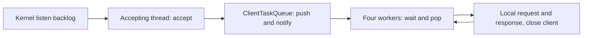

# Multithreaded HTTP Server

## Overview

An incremental C++ systems programming project working toward a multithreaded
HTTP server. Stage 11 caches static files behind method/path routing while
retaining one accepting producer, a synchronized FIFO of client sockets, and four
reusable worker consumers. Each worker takes a queued socket, parses a basic
request line, routes it to an HTTP response, closes the client
socket, and waits for another task.

## Features

- IPv4 TCP listener on loopback (`127.0.0.1`).
- Four fixed `std::thread` workers, reused across client connections.
- A FIFO client task queue protected by a mutex and condition variable.
- Default port 8080, with an optional command-line port from 1 to 65535.
- Socket address reuse, system-call error reporting, and explicit socket cleanup.
- Request-line collection across multiple receives, limited to 1,024 bytes.
- Basic method, path, and HTTP version extraction with malformed-input checks.
- Built-in GET home and health routes, plus files from `public/`.
- Binary-safe file reads, simple MIME types, and traversal/symlink rejection.
- Shared, mutex-protected LRU cache holding up to 16 static files.
- HTTP/1.1 200 OK, 400 Bad Request, and 404 Not Found with plain-text bodies.
- CRLF response formatting, computed Content-Length, and Connection: close.
- Partial-send and interrupted-call handling.
- Orderly client disconnect handling and connection-reset error reporting.
- TCP smoke validation, including byte counts, replies, and disconnects.

## Architecture

`main.cpp` validates the command-line port and calls `TcpServer::run()`.
The classes have distinct responsibilities:

| Class | Responsibility |
| --- | --- |
| `TcpServer` | Listening socket, producer accept loop, fixed worker startup/join, client I/O, and socket cleanup. |
| `ClientTaskQueue` | FIFO socket handoff, protected queue state, sleeping consumers, and internal queue closure. |
| `HttpRequest` | Validate the request line and store its method, path, and version as owned strings. No socket I/O or printing. |
| `HttpRouter` | Select built-in responses or delegate GET file requests to StaticFiles. |
| `StaticFiles` | Validate filenames, consult the cache, safely read misses, and choose Content-Type. |
| `LRUCache` | Store immutable file data and maintain bounded recency order under its own mutex. |
| `HttpResponse` | Own the status and body and serialize the same HTTP/1.1 response bytes, including CRLF and Content-Length. No socket I/O. |



The socket lifecycle remains visible in `src/tcp_server.cpp`:

```text
producer: accept -> queue.push -> notify_one -> repeat
consumer: queue.pop/wait -> recv -> parse -> route -> send -> close client -> repeat
```

The **producer** is the thread running `TcpServer::run()`. It alone calls
`accept()` and pushes each accepted socket into `ClientTaskQueue`. The four
**consumers** call `pop()` and process one client at a time. No new thread is
created for a client. `main.cpp`, request parsing, and HTTP response generation
remain unchanged.

The shared task container is `std::queue<int>`. A **mutex** protects both that
FIFO and its `closed_` flag. The exact **critical sections** are checking closure
and pushing; checking the wait predicate and removing the front item; and setting
the closed flag. No socket I/O, HTTP parsing, logging, or client cleanup happens
with this mutex held. FIFO means dequeue order, not response completion order.

The **condition variable** lets idle consumers sleep. `pop()` uses
`wait(lock, [this] { return closed_ || !sockets_.empty(); })`. Waiting releases
the mutex, and waking reacquires it before checking the predicate, so spurious
wakeups cannot cause an empty-queue pop. `push()` unlocks before `notify_one()`.
If a notification happens before a worker waits, the nonempty predicate still
lets it proceed. A worker removes one socket, releases the mutex when `pop()`
returns, and calls `handle_client()`.

Socket ownership moves from producer to queue on successful push, then to one
worker on pop. A failed insertion leaves the producer responsible for closing
that socket. `run()` owns the listener and joins workers before the queue goes
out of scope. Buffers, request and response objects, and send offsets are local
to each client handler; workers do not share application receive data.

`ClientTaskQueue::close()` is internal error cleanup, not a user-facing shutdown
feature. It rejects further pushes and wakes all waiting consumers. Already
queued tasks are drained; `pop()` returns false once closed and empty. On partial
pool startup failure, nothing has been accepted yet, so closing the empty queue
lets created workers return and be joined. On accept/enqueue failure, the
producer closes the listener, closes the queue, joins workers, and returns 1.
Active or queued slow clients can delay this cleanup indefinitely. The queue
must be drained by consumers before destruction; it does not itself close sockets.

**Stage 7 versus Stage 8:** previously each worker called `accept()`, leaving
connections in the kernel backlog when all four were busy. Now the producer
continues accepting into the application FIFO even when all workers are busy.
The kernel backlog (requested size 16) still holds connections not yet accepted;
the application queue holds descriptors already accepted by the process.
The FIFO is intentionally unbounded in this stage: queued connections consume
memory and descriptors, and overload can exhaust resources. No overload response,
timeout, or queue-capacity policy has been introduced.

The worker count remains `worker_count = 4`. Client errors affect only their
connection. Existing EINTR retry, partial-send handling, and MSG_NOSIGNAL are
preserved. Console output may interleave. Ctrl+C still stops the process
immediately and the OS reclaims sockets; no graceful shutdown framework is added.

TCP is a byte stream: one `recv()` need not contain everything the client sent.
The server appends exactly the received byte count until a newline arrives,
then requires CRLF and parses only the first line. Collection stops at 1,024
bytes (including CRLF); an unfinished line at that limit is rejected. EOF after
partial input is reported as incomplete. Malformed, incomplete, or overlong
lines get a 400 Bad Request response when the client can still receive data.
Rejected requests close their client socket after the reply without stopping the server.

The supported format is `METHOD /path HTTP/1.1\r\n` (also HTTP/1.0), with exactly
one space between fields. Method tokens are checked syntactically; parsing a
method does not implement its behavior. Paths must start with `/` and contain
only visible ASCII characters. Queries remain part of the printed path; URI
decoding and full URI validation are not implemented. Absolute-form targets
and `*` are outside this stage's supported subset.

### Routing

Routing selects a response using the parsed method and path. A **route** is a
recognized pair; its **handler** is the small branch that constructs its response.
`HttpRouter::route()` checks the two built-ins first, then delegates other GET paths:

| Method | Path | Status | Body (including newline) |
| --- | --- | --- | --- |
| GET | / | 200 OK | `Hello from C++ HTTP server!\n` |
| GET | /health | 200 OK | `OK\n` |
| GET | /filename | 200 if a readable regular file exists | File bytes |
| Unsupported method or missing/unsafe file | Any | 404 Not Found | `Not Found\n` |

**404 Not Found** means there is no matching built-in route or accessible static file. Unsupported methods also
use this fallback; no POST/body handling or HEAD semantics are implemented.
Matching is case-sensitive and exact: `/health/`, `/Health`, and
`/health?check=1` do not match `/health`. Query strings are not stripped.
Malformed request lines are rejected before routing with 400 Bad Request.

The worker parses an `HttpRequest`, passes it to a local, stateless `HttpRouter`,
and sends the returned `HttpResponse` using the existing partial-send loop.
Routes are fixed in code; there is no mutable routing table or additional lock.
Request/response objects remain local to each client. Networking stays in
`TcpServer`; parsing, routing, and serialization have separate responsibilities.
### Static files

A **static file** is returned as stored, without generating its contents.
The **document root** is `public/` relative to the server's working directory.
Run from the project root, or provide a `public/` directory in the chosen working
directory. No new command-line option is required. Built-ins `/` and `/health`
take precedence; other GET paths delegate to `StaticFiles`.

`/index.html` maps to `public/index.html`, `/style.css` to `public/style.css`,
and `/hello.txt` to `public/hello.txt`. Only single-level filenames are supported.
A **MIME type**, sent as Content-Type, tells clients how to interpret the bytes:
`.html` uses `text/html`, `.css` uses `text/css`, `.txt` uses `text/plain`, and
other extensions use `application/octet-stream`. Extension matching is case-sensitive.

**Directory traversal** attempts to escape the document root using path elements
such as `..`. The helper rejects dot-prefixed names, `..`, additional slashes,
backslashes, percent escapes, query strings, and fragments. It opens `public`
as a directory without following symlinks, then uses `openat` relative to that
open descriptor with `O_NOFOLLOW`. This avoids a check-then-open symlink race.
Only regular files pass `fstat`; nonblocking open prevents FIFO requests hanging.
Missing, unsafe, inaccessible, nonregular, or unreadable resources return 404.
Descriptors close through a small local RAII owner, including exception paths.

Reads append the actual byte count, not a null-terminated string. Embedded NULs
and arbitrary binary bytes are preserved; Content-Length uses the final body size.
Cache misses open and read files into local memory; cache hits reuse previously
loaded bytes. Files are read fully into memory,
so keep this learning server's public resources small. Concurrent file edits are
not snapshot-isolated. The document root is operator-controlled: do not place
sensitive files or hard links there. Subdirectories, URI decoding, streaming,
range requests, file-size limits, and directory listings are not implemented.

Responses use HTTP/1.1 even when the parsed request line says HTTP/1.0.

Headers or body bytes already received after the first line are ignored.
The server does not wait for or consume a complete HTTP request. Sending further
data while it closes may cause a TCP reset because unread data can remain.

### LRU static-file cache

A **cache** retains file contents in memory for reuse. A **hit** finds a stored
file; a **miss** reads it from disk and inserts it. **Capacity** is 16 entries
(not bytes), fixed in `StaticFiles::serve()`. Only successful regular-file reads
are cached; built-in routes, unsafe paths, and missing/unreadable files are not.
Filename validation runs before every cache lookup. Misses retain all Stage 10
`openat`, symlink, and regular-file checks.

**LRU** means least recently used. When inserting beyond capacity, **eviction**
removes the file that was used longest ago. `std::unordered_map` maps filenames
to list iterators for average constant-time lookup. `std::list` is a doubly
linked list: its front is most recently used (MRU), and its back is least
recently used (LRU). `splice` moves an existing node to the front without walking
the list. The map supplies fast access; the list supplies fast ordering/removal.
For capacity 3, shown **LRU to MRU**: A B C; access A -> B C A;
insert D -> C A D (B is evicted). Updating an existing key also promotes it.

One function-local static `LRUCache` is shared by all workers and initialized
once by C++'s thread-safe static initialization. Its dedicated mutex protects
map lookup, list promotion, insertion/update, and eviction as one critical
section. It is independent of the client-queue mutex. No disk reads, response
construction, serialization, recv, or send occur while holding the cache lock.
Concurrent misses for the same filename may read it independently; insert/update
still leaves exactly one entry. No request coalescing is implemented.

Entries contain body bytes and Content-Type through `shared_ptr<const CachedFile>`.
A hit copies this small ownership handle under the lock. Immutable bytes stay
alive for the worker even if another worker evicts the entry. This avoids copying
a file under the lock or exposing a dangling reference. New file data is built
outside the lock. Insertion rolls back its new list node if map allocation fails.

Map/list bookkeeping averages O(1) per lookup, insertion, update, and eviction
with respect to entry count. Hashing/copying a filename depends on its length;
file reads, body copying into HttpResponse, and serialization depend on byte
count. Capacity bounds retained entries, not total bytes; active workers can
retain evicted data temporarily. This is an algorithmic property, not a measured
performance claim.

There is no TTL or file-change invalidation. Edited, removed, or replaced files
may keep returning their previously safe bytes until eviction or process restart.
Even removing/replacing the public directory does not invalidate existing hits;
uncached paths still undergo the original safety checks. The working directory
and document root should remain fixed during a run. Concurrent edits during a
miss are not snapshot-isolated. Keep resources small and restart to reliably
refresh them during development.

## Technologies / Concepts

C++17, CMake, TCP/IP, POSIX sockets, file descriptors, network byte order,
blocking system calls, byte streams, partial sends, HTTP request-line syntax,
status lines, response headers, body lengths, exact method/path routing,
basic classes and encapsulation,
`std::thread`, a fixed worker pool, `std::queue`, `std::mutex`,
`std::condition_variable`, producer-consumer coordination, per-client ownership,
LRU caching with `std::unordered_map` and `std::list`, and basic error handling.
Python 3 is used only for tests.

## Project Structure

- `src/main.cpp`: port validation and server startup.
- `include/tcp_server.h`, `src/tcp_server.cpp`: socket lifecycle and client I/O.
- `include/http_request.h`, `src/http_request.cpp`: request-line parsing and fields.
- `include/http_router.h`, `src/http_router.cpp`: built-in and static route selection.
- `include/static_files.h`, `src/static_files.cpp`: safe file lookup and reading.
- `include/lru_cache.h`, `src/lru_cache.cpp`: synchronized file cache.
- `tests/lru_cache_test.cpp`: recency, capacity, ownership, and concurrency checks.
- `public/`: example HTML, CSS, and text resources.
- `tests/static_files.py`: isolated file, traversal, binary, and concurrency tests.
- `include/http_response.h`, `src/http_response.cpp`: HTTP response construction.
- `include/client_task_queue.h`, `src/client_task_queue.cpp`: synchronized FIFO.
- `tests/client_task_queue_test.cpp`: FIFO, wakeup, and closure checks.
- `tests/tcp_smoke.py`: HTTP, socket, concurrency, queueing, and idle-worker checks.
- `CMakeLists.txt`: executable, Threads::Threads linkage, warnings, and CTest integration.
- `AGENTS.md`: permanent development rules.
- `ROADMAP.md`: stage scope and completion status.

## Build

Use Linux (including a WSL distribution) with a C++17 compiler and CMake
3.16 or newer. Native Windows/MinGW builds are not supported by the POSIX source.
For Ubuntu, prerequisites can be installed with:

```sh
sudo apt-get update
sudo apt-get install build-essential cmake python3
```

On Alpine Linux, run `apk add --no-cache build-base cmake python3` as root.
Stages 1 through 11 were validated on Alpine Linux 3.22 under WSL2 with GCC 14.2.0,
CMake 3.31.7, and Python 3.12.14.

On this Windows development machine, enter the installed Linux environment:

```powershell
wsl -d HTTPServer-Alpine
```

Then navigate to the existing checkout inside Linux:

```sh
cd /mnt/c/Users/skg21/Documents/projects/HTTPS_Server
```

From the project root inside Linux:

```sh
cmake -S . -B build
cmake --build build
```

## Run

```sh
# Run from the project root so public/ is available.
./build/http_server
# Optional custom port:
./build/http_server 9090
```

The listener is local-only and runs until stopped with Ctrl+C. Each client gets
one request and response, then its socket closes; the listener remains open.
A partial line occupies one worker. The producer continues accepting while all
four are occupied; accepted clients wait in the application queue.

## Usage

In another terminal in the same Linux environment:

```sh
printf 'GET / HTTP/1.1\r\nHost: localhost\r\n\r\n' | nc -w 2 127.0.0.1 8080
```

The client receives the following response. Header lines use CRLF on the wire;
the 28-byte body includes its final newline.

```http
HTTP/1.1 200 OK
Content-Type: text/plain
Content-Length: 28
Connection: close

Hello from C++ HTTP server!
```

The server prints:

```text
Method: GET
Path: /
Version: HTTP/1.1
```

If netcat is unavailable:

```sh
python3 -c 'import socket; s = socket.create_connection(("127.0.0.1", 8080)); s.sendall(b"GET / HTTP/1.1\r\n"); print(s.makefile().read(), end=""); s.close()'
```

The Python client prints the HTTP response and reads until EOF. A client that
closes its sending side without sending data gets no reply; the server reports
the disconnect and closes only that client's socket.

Alternatively, use `curl -i --max-time 3 http://127.0.0.1:8080/` when available.
The same server can handle repeated and overlapping clients. To try a malformed line:

```sh
printf 'GET / WRONG\r\n' | nc -w 2 127.0.0.1 8080
```

This receives `HTTP/1.1 400 Bad Request`, the same content type and connection
headers, `Content-Length: 12`, and the body `Bad Request\n`.

Try the other route and the fallback:

```sh
printf 'GET /health HTTP/1.1\r\n' | nc -w 2 127.0.0.1 8080
printf 'GET /missing HTTP/1.1\r\n' | nc -w 2 127.0.0.1 8080
```

These return 200 with `OK\n` (3 bytes), and 404 with `Not Found\n`
(10 bytes), respectively. The existing home body is 28 bytes.

To fetch example files:

```sh
printf 'GET /index.html HTTP/1.1\r\n' | nc -w 2 127.0.0.1 8080
printf 'GET /style.css HTTP/1.1\r\n' | nc -w 2 127.0.0.1 8080
printf 'GET /hello.txt HTTP/1.1\r\n' | nc -w 2 127.0.0.1 8080
```

## Testing

With Python 3 available at CMake configuration time:

```sh
ctest --test-dir build --output-on-failure
```

Or run the checks directly:

```sh
./build/lru_cache_test
./build/client_task_queue_test
python3 tests/tcp_smoke.py ./build/http_server
python3 tests/static_files.py ./build/http_server
```

Integration tests require Linux `/proc` (including readable worker `wchan` files)
and port 8080 to be free. They verify the default and custom ports,
parsed fields, 200/400/404 status lines, exact headers, CRLF blank-line separation,
Content-Length against received body bytes, exact bodies, clean EOF, startup
exit status, continued service after client completion/errors, immediate
restart, invalid arguments, occupied ports, valid paths and versions, fragmented
lines (including split CRLF), the exact size limit, ignored trailing headers,
malformed lines (including embedded NUL), incomplete and overlong input,
EOF without data, and connection resets. The previous cases remain, with
per-client process-exit assertions replaced by continued-service checks and
explicit test-process cleanup. A concurrency test leaves two request lines
incomplete while six other clients get mixed 200/400/404 responses; then both slow
clients finish successfully and a fresh connection still works. This fails for
a sequential server without relying on throughput measurements.

The fixed-pool test records `/proc/<pid>/task` IDs: four workers plus the main
thread. It holds four slow requests open, connects eight additional clients,
and verifies no extra threads or responses appear while the pool is saturated.
Releasing just one slow client lets that same worker serve all eight waiting
clients. The thread-ID set stays unchanged through completion of all 12 clients.
The test also verifies that all 12 sockets are accepted, so eight really wait in
the application queue rather than the kernel backlog. Idle checks observe workers
sleeping in futex waits and allow at most two total CPU ticks over 200 ms. Three
additional waves of 32 mixed home, health, missing, unsupported-method, and
malformed requests verify repeated wakeups, worker reuse, and correct responses. These are correctness checks, not benchmarks.
The C++ queue test covers FIFO order, wait/push wakeup, rejection after closure,
draining queued work, repeated closure, and waking an empty consumer on closure.
Previous tests are retained. Partial sends and
interrupted system calls are handled in code but not deterministically forced
by these integration tests. Validation results are recorded
in [ROADMAP.md](ROADMAP.md). No performance claims are made.

For a manual overlapping-client check with the server running, start this in one
Linux terminal, then run a normal netcat request in another before the delay ends:

```sh
{ printf 'GET /'; sleep 5; printf ' HTTP/1.1\r\n'; } | nc -w 8 127.0.0.1 8080
```

With only one slow client, the normal client should finish before it. With four
such slow clients, later clients are accepted and queued until a worker is free.

Static-file tests use a temporary document root and verify exact example bytes,
MIME types, empty files, a 20,480-byte binary body, rejected traversal and symlinks,
nonregular resources, missing roots, and 94 requests through 12 concurrent clients,
including 24 distinct binary files that exceed cache capacity.
They also confirm hits retain cached bytes after a file edit, misses are not
negatively cached, and edited bytes appear after eviction.

The LRU unit test covers miss/hit, promotion, replacement, eviction, capacities
0/1/3, repeated hits, binary/MIME data, retained ownership after eviction, and
four threads running 4,000 combined put/get iterations.

## Roadmap

See [ROADMAP.md](ROADMAP.md) for the 14-stage development plan.

## Learning Outcomes

Explain the difference between listening and accepted sockets, why socket
addresses use network byte order, how a blocking accept behaves, and why every
acquired file descriptor must be closed on success and failure paths. Explain
why receive lengths matter, why TCP has no message boundaries, why sending may
require a loop, and how EOF differs from a receive error. Explain how a bounded
receive loop reconstructs a request line and why parsing that line does not
mean that a complete HTTP request has been read or handled. Explain how a status
line, headers, CRLF blank line, and a byte-counted body form an HTTP response.
Explain how separating socket I/O from parsing and serialization keeps each
class focused while preserving the observable behavior of the server.
Explain how fixed workers are reused, why four slow clients saturate this pool,
how the application FIFO separates acceptance from execution, why the wait
predicate matters, and why the critical section excludes client processing.

Explain how a route maps method/path to a handler, why unknown pairs return
404, and why immutable routing needs no synchronization beyond the client queue.
